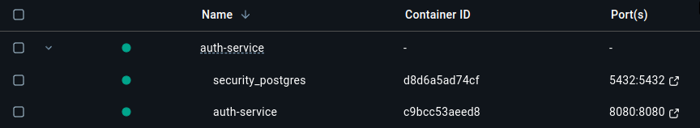
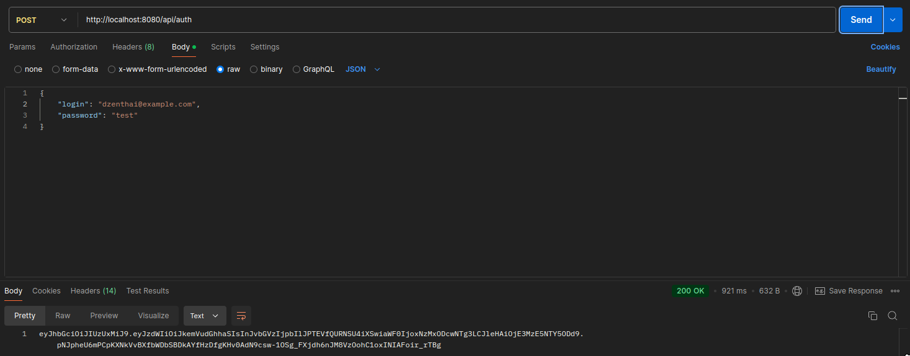
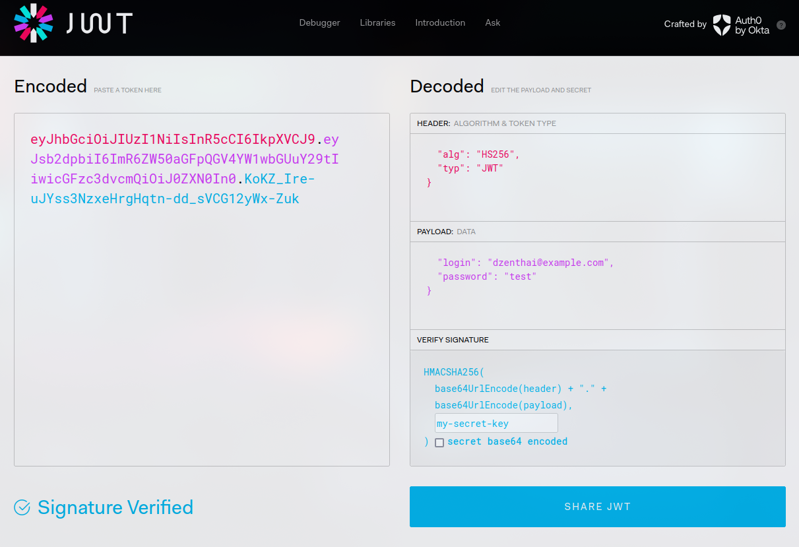
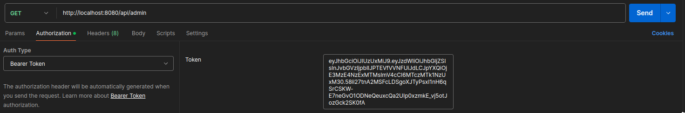
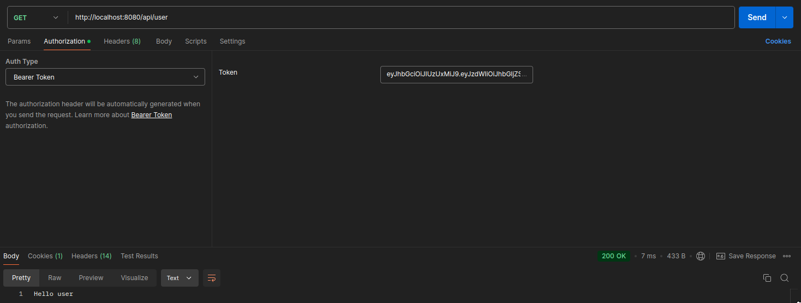
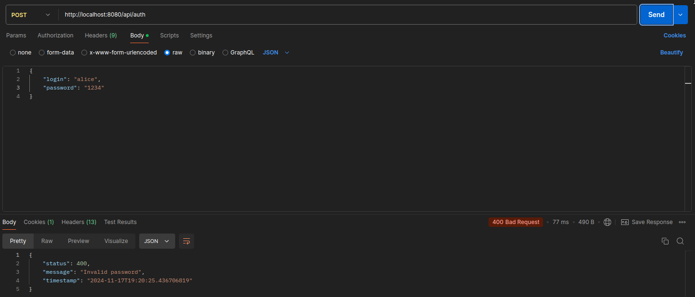

<div style="display: flex; flex-wrap: wrap; justify-content: center;">
    
    
</div>

## **Description**

**Auth-Service** is a Spring Boot application designed to provide robust user authentication and authorization.  
It uses **JWT (JSON Web Tokens)** for stateless authentication and supports role-based access control.  
This service is modular, flexible, and ready to integrate with other services in a microservice architecture.

---

## **Key Features**

- **JWT-based authentication**:
    - Secure token generation, validation, and parsing.
    - Stateless user session management.

- **Role-based access control**:
    - Different access levels for users (`ROLE_USER`) and administrators (`ROLE_ADMIN`).

- **Spring Security Integration**:
    - Custom filters for request validation.
    - Token-based authentication flows.

- **Exception handling**:
    - Centralized error handling with meaningful messages and proper HTTP status codes.

- **User management**:
    - Authentication via username or email.
    - Password encryption using `BCrypt`.

---

## **Technologies**

- **Java** – The primary programming language.

- **Spring Boot** – Framework used for building the service.

- **PostgreSQL** – Database for storing data.

- **JWT** – Stateless authentication mechanism.

- **Docker** – Containerization platform for packaging the application with dependencies, ensuring consistent
  environments and simplifying deployment.

---

## **How it Works**

**Container Initialization**:

- When the system is started using `docker-compose up`, two containers are initialized:
    - **Application Container**: Runs the Spring Boot application.
    - **Database Container**: Runs a PostgreSQL instance for storing user and authentication data.
- The application container waits until the database container is fully up and ready to accept connections.



**User Authentication**:

- Users provide credentials (username or email + password) to authenticate.
- If credentials are valid, a JWT is generated and returned.



**JWT Structure**:

- Token contains claims such as roles and expiration time.
- Tokens are signed with a secret key for integrity.



**Request Flow**:

- A client sends requests with the JWT in the `Authorization` header.
- The `JwtFilter` validates the token and sets the user in the `SecurityContext`.



**Role-Based Access**:

- Endpoints are secured based on roles:
- `/api/user` – Accessible by users with the `ROLE_USER`.
- `/api/admin` – Accessible only to `ROLE_ADMIN`.



**Error Handling**:

- Custom exceptions for bad credentials and unknown users.
- Expired or invalid tokens trigger appropriate HTTP errors.

  

---

## **Installation Guide**

### **Prerequisites**

- Java 23
- Gradle 8.10.2
- Postman 11.19.0
- Docker 27.2.0

### **Installation and Startup Steps**

1. **Clone the Repository**
   ```bash
   git clone https://github.com/dzenthai/auth-service.git
   cd auth-service
   ```

2. **Add Environment Variables**
   Create an .env file and add the required environment variables such as JWT secret and lifetime.

3. **Build the Project Using Gradle**
   ```bash
   ./gradlew build
   ```

4. **Run the Application Using Docker**
   ```bash
   docker-compose up --build
   ```

---

## **Additional Information**

You can use these credentials to test the application:

        username: dzenthai
        email: dzenthai@example.com
        password: test

        username: alice
        email: alice@example.com
        password: A1ic3#Str0ngP@ss

        username: bob
        email: bob@example.com
        password: B0b_Sup3rS3cur3

These credentials can be used to authenticate and test various endpoints of the application. For example, you can use
tools like Postman, cURL, or a frontend interface to log in with these users and validate the system's behavior,
including token generation, role-based access control, and secured resource access.